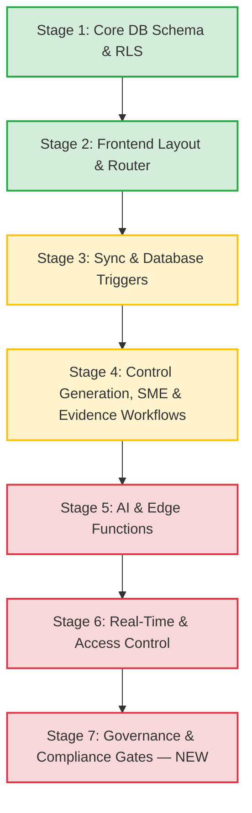

# UCIL Build Stages 1.1
## Unified Control Intelligence Layer (UCIL) — Implementation Stages & Status
**Version:** 1.1
**Status:** DRAFT — supersedes v1.0 "Approved" status pending Stage 5/6 completion (see PRD v1.1 §9)
**Author:** AI Coding Assistant (drafted); requires human engineering lead sign-off
**Date:** July 5, 2026
**Changelog from v1.0:** Split evidence/control-generation workflows into confidence-tiered stages; added AI-failure fallback state; added human-override audit fields; added data residency gate; corrected status labeling to reflect actual readiness; stack remains **Supabase** per decision.

---

## Executive Summary

This document tracks development stages for UCIL, an AI-assisted compliance aggregation platform. It reflects the updated workflow clarification: **Unified Control Generation** and **Evidence Validation** are now explicitly two-stage, confidence-tiered processes with distinct queues, distinct approvers, and mandatory human-override logging — not a single AI-verdict-then-review step as drafted in v1.0.

---

## Build Stages Overview

**Legend**: 🟢 Complete | 🟡 In Progress | 🔴 Pending.

A **Stage 7 (Governance & Compliance Gates)** has been added — it did not exist in v1.0 and captures the items that block moving this project from "Draft" to genuinely "Approved."

---

## Detailed Build Stages

### Stage 1: Core Database Schema, Views, & RLS
* **Status**: 🟢 100% Complete (**re-scoped**, not re-opened)
* **Existing work retained** — 15 tables, views, `get_user_role()`/`get_user_domain()`, RLS, audit logging.
* **New required additions (carried from PRD §7):**
  * `human_overridden boolean` + `override_reason text` on `controls` and `evidence`.
  * `ai_status` enum (`ok`, `error`, `pending_regeneration`) on both tables to distinguish AI failure from low-confidence rejection.
  * New table: `control_generation_queue` (distinct from `sme_review_queue`) to hold Control Generation Confidence records, with a `regeneration_attempt_count` column and a hard cap of 3.
  * `control_framework_mappings` needs a per-mapping `compliance_status` field (Compliant/Partially Compliant/Not Compliant) — required by PRD §4.1.2, not present in v1.0 schema.
  * **RLS re-verification task**: confirm whether "authenticated read = all controls" is an intentional broad-read design or a gap versus the domain-segmented RBAC promised in the PRD. This must be explicitly answered, not assumed, before Stage 1 can be called fully closed against the *current* requirements.

---

### Stage 2: Front-End Core Layout & Navigation
* **Status**: 🟢 100% Complete — unchanged, no new requirements from the workflow clarification.

---

### Stage 3: Data Ingestion & Synchronization Rules
* **Status**: 🟡 85% Complete (**revised down from 90%** — new sync rules added below)
* **Completed Work**: unchanged from v1.0 (metrics-table triggers, dashboard correction, page wiring to `metrics`).
* **Corrected in this version**: the `ai_auto_approval_rate` KPI formula in `recalculate_metrics()` is confirmed as the canonical definition (Auto-Approved mappings ÷ Total mappings). The PRD's earlier alternate definition is retired — no code change needed here, but this stage is not "done" until the PRD/dashboard tooltip copy is updated to match, since a mismatched label is a real user-facing defect even if the SQL itself is fine.
* **Remaining Work**:
  * Deploy triggers to live Supabase DB; load-test with bulk inputs (unchanged from v1.0).
  * Add trigger/logic to keep the new `control_generation_queue` counts flowing into `metrics` (new — required by PRD §5.2 rule 3, which now includes the Control Generation Queue in the In-Progress sum).
  * Add validation query confirming confidence-tier bucket totals reconcile (PRD §5.2 rule 8) — no record should disappear between "direct approval," "two-stage," and "auto-rejected" counts.

---

### Stage 4: Unified Control Generation, SME & Evidence Workflows
*(renamed from "SME & Evidence Workflows" — scope has grown)*
* **Status**: 🔴 55% Complete (**revised down from 75%** — the two-tier confidence workflow is substantially new work, not a refinement of what existed)
* **Completed Work carried over**:
  * Unified Control Library page (`ingest.js`) — filter/detail view.
  * SME Review Queue page — approve/reject/edit low-confidence *mapping* suggestions (clause→existing control only).
  * Evidence Management UI — 5 summary boxes, Evidence Folder Summary card.
  * `sync_evidence_to_control` DB trigger.
* **New work required (not previously scoped)**:
  * Build the **Control Generation Queue** UI — separate from SME Review Queue — showing: source clauses, proposed unified statement, Control Generation Confidence Score, conflict-resolution notes (stricter-value reconciliation with original per-framework values preserved), and routing (direct-to-Domain-Owner vs. two-stage).
  * Build **Control Owner first-stage review** screen for medium-confidence (0.65–0.85) unified controls — currently the app only supports a single-stage SME approve/reject, not the two-stage Control Owner → Domain Owner flow.
  * Build **Evidence two-stage review**: Control Owner first-pass, then Domain Owner final approval, for evidence in the 0.70–0.90 Evidence Validation Confidence band — v1.0 only wired a single Domain Head review step.
  * Add regeneration handling: when Control Generation Confidence < 0.65, surface a "regenerate" action (capped at 3 attempts) instead of a dead-end rejection.
  * Add the `Reassigned`-with-AI-notes flow for evidence < 0.70 — AI-extracted missing elements/red flags must be attached to the reassignment, not just a bare rejection.
* **Remaining Work carried over**: Supabase Storage upload trigger wiring, token/folder permissions, live API calls replacing fallback array changes.

---

### Stage 5: AI Agent Integration & Edge Functions
* **Status**: 🔴 30% Complete (**revised down from 40%** — two functions need materially expanded output contracts)
* **Completed Work carried over**: 10 Deno Edge Functions scaffolded, `ai-client-functions.js` wrapper script, DB trigger wiring for automatic AI invocation.
* **Contract changes required (blocking)**:
  * `canonical-generation` must return `{ unified_statement, source_refs[], conflict_resolution_notes, confidence_score, regeneration_attempt_count }` — v1.0 scaffold does not specify a confidence score or regeneration counter in its output contract.
  * `evidence-verdict` must return `{ verdict, confidence_score, missing_elements[], red_flags[] }` — v1.0 treats verdict as a bare Approved/Rejected with no numeric confidence, which is incompatible with the tiered workflow now required.
  * **AI-failure fallback (new, blocking for production use)**: every Edge Function invocation triggered by a DB event must be wrapped so that a timeout, non-2xx response, or malformed JSON sets `ai_status = 'error'` and routes the record to a `Pending Manual Review` state — never leaves it silently unprocessed, and never auto-fails it into `Rejected`.
* **Remaining Work carried over**: append client functions to `supabase-client.js`, wire gaps/evidence action buttons, deploy via CLI, set `GROQ_API_KEY`/`SUPABASE_URL` secrets.

---

### Stage 6: Real-time Subscriptions & Access Controls
* **Status**: 🔴 30% Complete — unchanged from v1.0; still blocking.
* **Completed Work carried over**: `login.html`, basic auth redirect in `initApp()`, sidebar logout.
* **Remaining Work carried over**: wire `subscribeToMetrics`; test role-permission logic to prevent Control Owners from reaching admin/Domain-Owner approval actions — **now explicitly including** the new Control Generation Queue and evidence two-stage approval screens, since these introduce two *new* approval-gated UI surfaces that must be permission-tested, not just the existing ones.

---

### Stage 7: Governance & Compliance Gates *(new)*
* **Status**: 🔴 0% Complete — not previously tracked as a stage; these are the items that actually determine whether this system is defensible in front of a regulator or auditor.
* **Required Work**:
  * Resolve and document data residency / localization posture for the Supabase project given RBI-relevant data (blocking — see PRD §7.5).
  * Confirm and document that RLS "authenticated read = all controls" is an intentional design choice, or tighten it to match domain-segmented RBAC as promised in the PRD.
  * Populate `human_overridden`/`override_reason` end-to-end and verify every AI-influenced status change is traceable in `audit_log` with actor + confidence score at time of action.
  * Obtain named human sign-off replacing "AI Coding Assistant" as document author/approver before this moves from Draft to Approved status.
  * Configuration surface for org-tunable thresholds (mapping, control-generation, evidence-validation, regeneration cap) per PRD §8 — must not be hard-coded constants in Edge Function source.

---

## Validation & Launch Checklist (updated)

### 1. Database Deployment Validation — unchanged, plus:
- [ ] Verify `control_generation_queue`, `human_overridden`, `override_reason`, `ai_status` columns/tables exist and are populated by triggers.
- [ ] Verify `control_framework_mappings.compliance_status` is present and populated independently per framework (not inherited blindly from the parent control).

### 2. Edge Function Deployment Validation — unchanged, plus:
- [ ] Confirm `canonical-generation` and `evidence-verdict` responses include a numeric confidence score and route correctly to direct-approval / two-stage / auto-reject per the configured thresholds.
- [ ] Simulate an Edge Function timeout/error and confirm the record lands in `Pending Manual Review` with `ai_status = 'error'` — not silently stuck, not auto-rejected.

### 3. Front-End Ingestion & Mapping Verification — unchanged, plus:
- [ ] Confirm Control Generation Queue and SME Review Queue are visually and functionally distinct (different tables, different approvers).
- [ ] Confirm a medium-confidence unified control routes to Control Owner first, then Domain Owner — not a single-step approval.
- [ ] Confirm a medium-confidence evidence submission follows the same two-stage pattern.

### 4. Synchronization Integrity Verification — unchanged, plus:
- [ ] Verify Dashboard In-Progress count includes the Control Generation Queue (PRD §5.2 rule 3).
- [ ] Run the confidence-tier reconciliation query (PRD §5.2 rule 8) and confirm no records vanish between tiers.
- [ ] Confirm a conflicting-requirement control (e.g., 6-month vs. 12-month retention) shows **Compliant** for the 6-month framework and **Partially Compliant** for the 12-month framework simultaneously under the same unified control (PRD §4.1.2) — this is the single most important functional test of the whole redesign and was not previously testable under v1.0.
